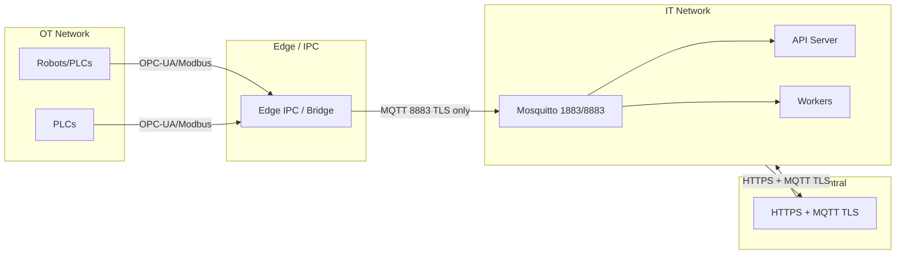

# Network Segmentation

This document describes the recommended network segments and data flow for PDM Pilot, and the firewall rules at each boundary.

## Segment Overview

## Segments and Data Flow

### 1. OT Network (Operational Technology)

- **Contents:** Robots, PLCs, and physical devices that produce sensor/control data.
- **Isolation:** Isolated segment; no direct connectivity from IT or internet.
- **Outbound:** Only necessary industrial protocols (e.g. OPC-UA, Modbus, S7) to the Edge segment.

### 2. Edge / IPC (Demilitarized / Edge Segment)

- **Contents:** Edge service or bridge that talks to OT devices and publishes to MQTT (e.g. stream publisher, ABB/Siemens adapters).
- **Inbound from OT:** Allow only required OT protocols (OPC-UA, Modbus, etc.) from OT to Edge.
- **Outbound to IT:** One-way or strictly controlled data flow. Only MQTT over TLS (port 8883) from Edge to the IT MQTT broker. No inbound from IT to Edge except for management/updates if explicitly documented and secured.

### 3. IT Network

- **Contents:** MQTT broker (Mosquitto), API server, workers, Redis, database, Prefect.
- **MQTT:**
  - **Port 1883:** Internal only (container-to-container or same-host). No TLS; for services that do not cross segment boundaries.
  - **Port 8883:** MQTT over TLS with mutual authentication. Use for any client that is not on the same trusted internal network (e.g. Edge, remote clients). Certificates: `docker/mosquitto/certs/` (CA, server, client); `require_certificate true` on 8883.
- **API:** Served over HTTPS (enforced at reverse proxy/load balancer). No plain HTTP in production across segment boundaries.

### 4. Cloud / Central Server (Optional)

- **Contents:** Central analytics, dashboards, or fleet management.
- **Communication:** HTTPS and, if needed, MQTT over TLS (8883) only. No plain MQTT (1883) or HTTP from/to the internet.

## Firewall Rules by Boundary

### OT ↔ Edge

| Direction   | Source | Destination | Port/Protocol | Rule  |
|------------|--------|-------------|----------------|-------|
| OT → Edge  | OT     | Edge        | OPC-UA, Modbus, S7 (as required) | Allow |
| Edge → OT  | Edge   | OT          | As needed for management only   | Allow only if required; otherwise Deny |
| IT → OT    | IT     | OT          | Any                            | Deny  |

### Edge → IT

| Direction   | Source | Destination | Port/Protocol | Rule  |
|------------|--------|-------------|----------------|-------|
| Edge → IT  | Edge   | MQTT broker | 8883 (MQTT over TLS)           | Allow |
| Edge → IT  | Edge   | IT          | 1883 (plain MQTT)              | Deny (use 8883 only across boundary) |
| IT → Edge  | IT     | Edge        | Any                            | Deny (or allow only management/update paths if defined) |

### IT ↔ Cloud / Internet

| Direction   | Source | Destination | Port/Protocol | Rule  |
|------------|--------|-------------|----------------|-------|
| IT → Cloud | IT     | Cloud       | 443 (HTTPS)                    | Allow as needed |
| IT → Cloud | IT     | Cloud       | 8883 (MQTT TLS)                | Allow if used |
| Cloud → IT | Cloud  | IT          | 443 (HTTPS)                    | Allow only to API/load balancer |
| Cloud → IT | Cloud  | IT          | 8883 (MQTT TLS)                | Allow only to MQTT broker if required |
| Any        | Internet | IT        | 1883, 8883, 443                | Restrict to known IPs/VPN; default Deny for 1883/8883 |

### Internal IT (same segment)

- Allow container-to-container and host-to-container on 1883 (MQTT), 5432 (PostgreSQL), 6379 (Redis), 4200 (Prefect), and application HTTP ports as needed.
- Expose 8883 only to segments that require cross-boundary MQTT (e.g. Edge); do not expose 1883 to Edge or internet.

## Summary

- **OT → Edge:** Only industrial protocols; no IT-originated traffic to OT.
- **Edge → IT:** Only MQTT over TLS (8883); no plain MQTT (1883) across the boundary.
- **IT → Cloud:** HTTPS and optionally MQTT TLS outbound; restrict inbound to HTTPS and, if used, MQTT TLS from trusted sources.
- **Internal IT:** 1883 for internal-only MQTT; 8883 and HTTPS for cross-segment and external access.

See also: [NIST_800_171_MAPPING.md](NIST_800_171_MAPPING.md) (SC — System and Communications Protection), [config.py](../config.py) (MQTT TLS settings), [docker/mosquitto/mosquitto.conf](../docker/mosquitto/mosquitto.conf).
